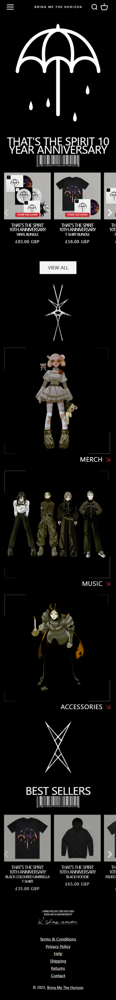
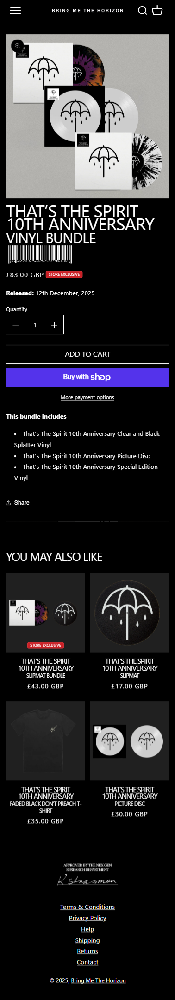

[README.md](https://github.com/user-attachments/files/22127977/README.md)
# Procesverslag
Markdown is een simpele manier om HTML te schrijven.  
Markdown cheat cheet: [Hulp bij het schrijven van Markdown](https://github.com/adam-p/markdown-here/wiki/Markdown-Cheatsheet).

Nb. De standaardstructuur en de spartaanse opmaak van de README.md zijn helemaal prima. Het gaat om de inhoud van je procesverslag. Besteedt de tijd voor pracht en praal aan je website.

Nb. Door *open* toe te voegen aan een *details* element kun je deze standaard open zetten. Fijn om dat steeds voor de relevante stuk(ken) te doen.

## Jij

  
uitwerken voor kick-off werkgroep

  ### Auteur:
  Melih Celik

  #### Je startniveau:
  Rood

  #### Je focus:
  Responsiveness
 

## Je website

  
uitwerken voor kick-off werkgroep

  ### Je opdracht:
  https://shop.bmthofficial.com/
  (homepagina en een productpagina)

  #### Screenshot(s) van de eerste pagina (small screen): 
  
  

  #### Screenshot(s) van de tweede pagina (small screen):
  
  
 

## Toegankelijkheidstest 1/2 (week 1)

  
uitwerken na test in 2e werkgroep

  ### Bevindingen
  Lijst met je bevindingen die in de test naar voren kwamen:
  - Geen alt teksten
  - Geen light mode (site is al donker)
  

## Breakdownschets (week 1)

  
uitwerken na afloop 3e werkgroep

  Link naar mijn breakdown schets:
  https://www.figma.com/design/zKko9KrDx9agR3msY1vCYm/Untitled?node-id=1-2&t=DcGmd728p6sILTlv-1
  

## Voortgang 1 (week 2)

  
uitwerken voor 1e voortgang

  ### Stand van zaken
  hier dit ging goed & dit was lastig (neem ook screenshots op van delen van je website en code)

  - Wat ging goed: Ik had een goede start, snelle begin met mijn header en kon meteen naar de hamburger menu
  - Wat was lastig: De header had ik eerst anders gedaan, dus ik moest weer opnieuw beginnen van 0 om het beter te maken wat wel tijd en moeite kostte

  Bespreken met groepje:
  HTML bekijken, carousel met pijltjes, video embed, site op de beste manier responsive maken, hoe een kaart op een website bruikbaar maken

  ### Verslag van meeting
  hier na afloop snel de uitkomsten van de meeting vastleggen

  - Geen google kaarten gebruiken maar open source
  - 3 Style sheets inleveren, algemeen, pagina 1, pagina 2
  - Font face moet je gebruiken, geen google fonts
  - Svg's kan je pakken van een site door via element inspect te kopieren
  - Aria-hidden tag leest de screenreader niet

    

## Voortgang 2 (week 3)

  
uitwerken voor 2e voortgang

  ### Stand van zaken
  Ik heb kunnen werken aan mijn header, ook geleerd hoe ik het op een betere manier kon doen wat mijn uiteindelijk veel tijd zou besparen (2 navs gebruiken i.p.v. 1). Ik was ook eerst begonnen met big screen en niet mobile first dus opnieuw      beginnen was het beste optie, ik ben van plan om z.s.m aan de hamburger menu te werken.

  Vragen per leerling:
  Melih: Html check & hoe je je site responsive maakt 
  Eva: Video van een site pakken en zelf gebruiken
  Bo: Vraag of haar html klopt
  Demi: Vraag of haar html klopt
  

  ### Verslag van meeting
  hier na afloop snel de uitkomsten van de meeting vastleggen

  - Sections moeten een header hebben
  - Letten op toegankelijkheid

## Toegankelijkheidstest 2/2 (week 4)

  
uitwerken na test in 9e werkgroep

  
  
  
  
  

## Voortgang 3 (week 4)

  
uitwerken voor 3e voortgang

  ### Stand van zaken
  Dark mode alleen nog toevoegen, tweede pagina maken en eerste pagina nog de helft responsive maken.

  ### Agenda voor meeting
  samen met je groepje opstellen

  Eva: Html css goed?
  Melih: Beste manier van responsive maken?
  Demi: Responsive maken

  ### Verslag van meeting
  hier na afloop snel de uitkomsten van de meeting vastleggen

  - Niet veel uitgehaald qua feedback, ik was goed op weg kreeg ik te horen
  - Section mist nog wel header

## Eindgesprek (week 5)

  
uitwerken voor eindgesprek

  ### Je uitkomst - karakteristiek screenshots:
  

  ### Dit ging goed/Heb ik geleerd: 
  Geleerd hoe je nth-of-type etc. heb gebruikt. Vond het heel lastig in het begin maar het is me uiteindelijk gelukt en ik kan het nu zonder problemen gebruiken. Dus ik zit niet meer aan divs of classes vast voor in de toekomst!

  

  ### Dit was lastig/Is niet gelukt:
  Het lastige gedeelte was de quantity op mijn tweede pagina. Met js kreeg ik het niet te werken, en helaas had ik niet veel tijd meer dus haalde ik het niet.

  

## Bronnenlijst

  
continu bijhouden terwijl je werkt

  Nb. Wees specifiek ('css-tricks' als bron is bijv. niet specifiek genoeg). 
  Nb. ChatGpT en andere AI horen er ook bij.
  Nb. Vermeld de bronnen ook in je code.

  1. Codepen
  2. Sanne & Bahaa
  3. Shop.bmthofficial.com
  4. ChatGPT (vooral als iets helemaal niet lukte / troubleshooting)

